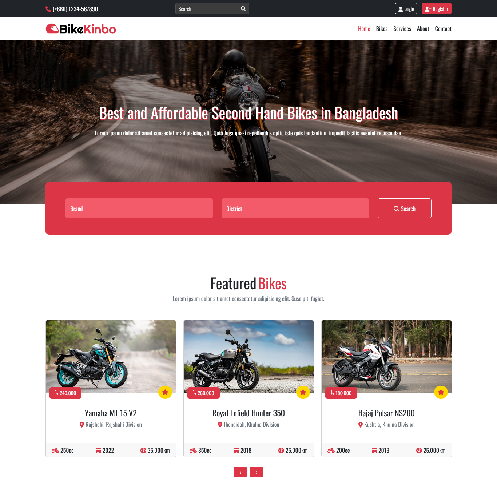
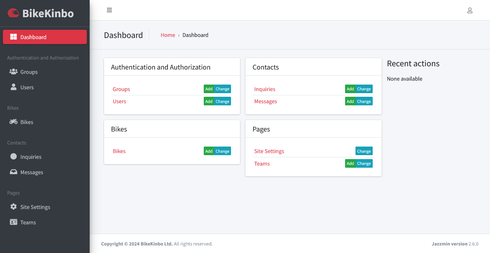
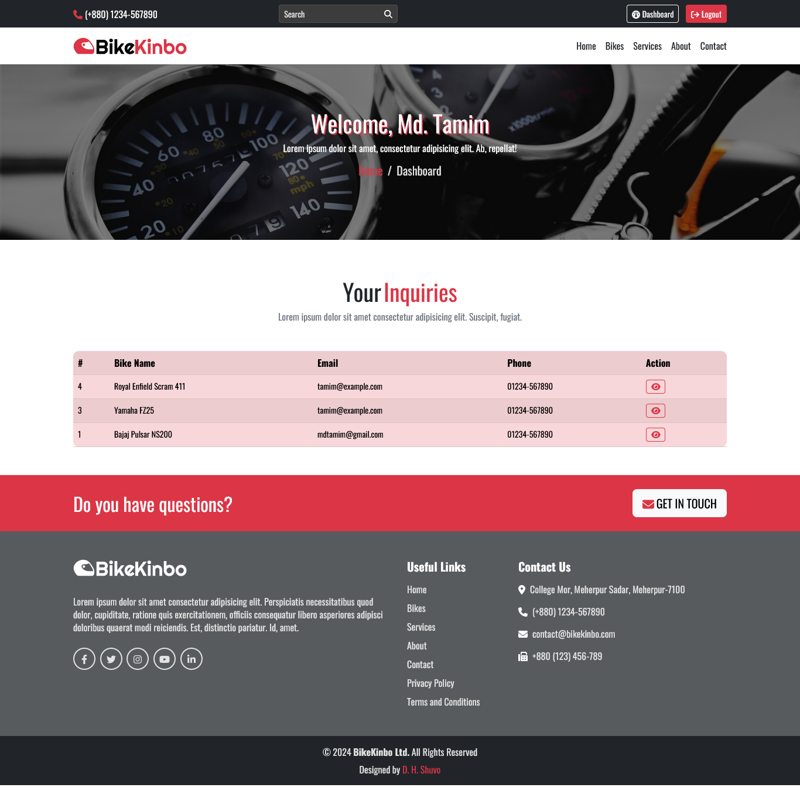

# BikeKinbo Marketplace

An online marketplace for buy/sell old bikes.

| Previews                                                                                     |
| -------------------------------------------------------------------------------------------- |
| *Homepage*<br/>                        |
| *Admin panel*<br/> |
| *User's dashboard*<br/>                |

---

## Requirements

- Python >= 3.11

- PostgreSQL

- smtp4dev

- Git Bash (Optional)

---

## Installation

Open `cmd` or `bash` in the project directory.

- **Install Python virtual environment**

```bash
pip install virtualenv
```

- **Create a virtual environment**

```bash
virtualenv env
```

If a higher version of Python is not working, install `Python 3.11`. Then create a virtual environment.

```bash
virtualenv env --python=python3.11
```

- **Activate virtual environment**

On `Mac` and `Linux`

```bash
source env/bin/activate
```

On `Windows` (If you are using `cmd`)

```bash
.\env\Scripts\activate
```

On `Windows` (If you are using `Bash`)

```bash
source env/Scripts/activate
```

- **Install dependencies**

```bash
pip install -r requirements.txt
```

---

## Environment Variables

To run this project, you will need to create and add the following environment variables to your `.env` file.

- Create a `.env` file in the root directory.

- Create a new `PostgreSQL` database.

- Use `smtp4dev` , if you want to run e-mail server locally or use your own `smtp` server.

- Generate a new secret key:

```bash
python manage.py shell -c "from django.core.management.utils import get_random_secret_key; print(get_random_secret_key())"
```

```bash
SECRET_KEY="YOUR_SECRET_KEY"
DEBUG="True"

# Database
DB_NAME="YOUR_DB_NAME"
DB_USER="YOUR_DB_USER"
DB_PASSWORD="YOUR_DB_PASSWORD"
DB_HOST="YOUR_DB_HOST"
DB_PORT="YOUR_DB_PORT"

# Email
EMAIL_HOST = "YOUR_EMAIL_HOST"
EMAIL_PORT = "YOUR_EMAIL_PORT"
EMAIL_HOST_USER = "YOUR_EMAIL_HOST_USER"
EMAIL_HOST_PASSWORD = "YOUR_EMAIL_HOST_PASSWORD"
EMAIL_USE_TLS = True
```

---

## Run Locally

- **Migrate database**

```bash
python manage.py makemigrations && python manage.py migrate
```

- **Create an admin user**

```bash
python manage.py createsuperuser
```

- **Run the `Django` server**

```bash
python manage.py runserver
```

You can access the website at http://127.0.0.1:8000/ and the admin panel at http://127.0.0.1:8000/admin

---

## License

[MIT](https://choosealicense.com/licenses/mit/)
